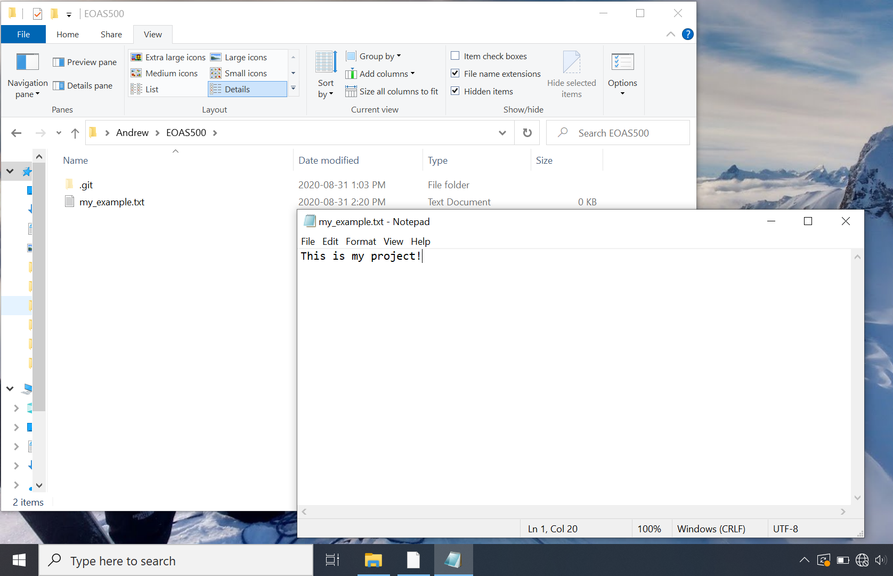

# Git and and GitHub Crash Course

---

## Introduction

The purpose of this tutorial is to aid students who lack formal background in computer science by introducing several extremely helpful tools used for developing code keeping files organized. If you are not yet familiar with "shells" and working at your computer's command line, check out the [Using a Shell](shells_crash_course.html) page.

The focus on this page is on setting up and using **Git** to track changes to files and using **Github** as a remote file backup system, to prevent the dreaded "computer crashes the week before a thesis defense, leaving you with nothing" scenario.

## Git and Github


Source: http://phdcomics.com/comics/archive.php?comicid=1531>

<br>
<br>

Good housekeeping within your computer's file system is an essential skill that every coder needs to develop. Writing and debugging code often involves a lot of trial and error, and often it makes sense to retain earlier versions of your project so in case you accidentally break your code, you can revert to the old version and try again. However, cluttered folders jammed with nearly identical copies of the same file/program is clearly not the elegant solution we would prefer to use. *Git* is a file management and version control system designed to avoid this scenario. Instead of saving each iteration of your project as a separate file and creating clutter, Git allows you to periodically check in your work (referred to as a *commit* in git parlance), keep notes on what changes were made, who made them, and allows you to revert to previous versions in case you or someone else accidentally introduces unwanted changes to your project. This is how most professional programmers keep track of their work. Beyond what is discussed here, Git has a huge range of additional features aimed at developers working collaboratively on complex software. Generally speaking, it is best to start with the simplest possible workflow progress from there depending on your team's specific demands.

 The instructions here are meant to set up a *code repository* on your computer which backs up your work each time you make a change (*making commits*), and saves copies of your files in the cloud on *Github* (*pushing* files to a *remote repository*). Once we gain some familiarity *committing* and *pushing* with Git, we will be ready to tackle the full *pull request workflow* (meant for collaborating on projects with larger groups), *cloning* repositories (making a copy of someone else's work and introducing your own changes), working on *branches* ()

Begin by following the instructions [here](https://git-scm.com/book/en/v2/Getting-Started-Installing-Git) to install git on your machine. Next, we can associate a username and email address with your git installation by opening a shell and typing:

```
$ git config --global user.name "Max Planck"
$ git config --global user.email mplanck@example.com
```

The name and email you enter here will be attached to each commit you make to your projects or ones you collaborate on. We are now ready to *initialize a repository* for our project. Open a shell and navigate (change directory using ```cd```) to the EOAS500 folder we created earlier, then type ```git init``` to create the repository.

```powershell
$ cd EOAS500
$ git init
```


Open a file explorer/finder window and navigate to EOAS500. You may see a ```.git``` folder has appeared there. If you cannot see the folder, try following the instructions [here](myurl.com) for windows, or [here](myurl.com) on a mac to show hidden folders.

Now let's add some content to our folder, as if we were working on a real project. For this example, create a file called ```my_example.txt``` using a text editor and save it in your EOAS500 folder. Git will tolerate almost any file type (.txt, .csv, docx, .py, .R, .m, etc).



Currently ```my_example.txt``` is saved on our hard drive but *not* tracked by git. You can check the status of the git repository by typing:

```
$ git status
```
You should see:

```
$ git status
On branch master

No commits yet

Untracked files:
  (use "git add <file>..." to include in what will be committed)
        my_example.txt

```

```my_example.txt``` is listed as an *untracked file,* which means we have not saved any changes using git.  files to a git repository happens in two steps. First files are *added* to a staging area, then *committed* to the repository and logged.

```
$ git add my_example.txt
```

or to stage all files in the working directory, (right now there is only one) type:

```
$ git add .
```

If we wish to see the result of what we just did, type ```git status``` again (not necessary, but a good idea). You should see:

```
$ git status
On branch master

No commits yet

Changes to be committed:
  (use "git rm --cached <file>..." to unstage)
        new file:   my_example.txt
```

As per the helpful hint above, you can remove files from the staging area using ```git rm --cached <file>```. Once we are happy with which files are staged (only one for now), it's time to *commit* ```my_example.txt``` to our repository. Best practice is to include a short message with every commit, summarizing the changes you made in a few words. "initial commit" is a good commit message for the first commit to a repository. Type:

```
$ git commit -m 'initial commit'
```

Once you press ```enter```, git saves everyting from the staging area to your repository, logs the author (you) time the commit was made (now), and assigns a *commit hash,* a unique alphanumeric key used to identify this particular commit. To show the log for your most recent commit, type:

```
$ git log -1
```

(To see your second most recent commit, replace the ```-1``` with ```-2```) The output should look something like:

```
commit dda127f4fe6ac60bd8fbba18d15931ae5d182733 (HEAD -> master)
Author: Max Planck <mplanck@example.com>
Date:   Mon Aug 31 15:37:36 2020 -0700

    initial commit
```

We can also check ```git status``` one more time to see that our file has been committed successfully.

```
$ git status
On branch master
nothing to commit, working tree clean
```


---

For reference, here are all of the git commands used in this tutorial:

```git config --global user.name "Max Planck" ```$\rightarrow$ assign your name to your git repository (only do this once when you install git)

```git config --global user.email mplanck@example.com``` $\rightarrow$ assign your email address to your git repository (only do this once when you install git)

```git init``` $\rightarrow$ create a new repository in the working directory

```git status``` $\rightarrow$ show the status of the repository, which files are tracked and which have uncommitted changes

```git add <file>``` $\rightarrow$ add ```<file>``` to the staging area

```git add .``` $\rightarrow$ add all files in the working directory to the staging area

```git rm --cached <file>``` $\rightarrow$ remove ```<file>``` from the staging area

```git commit -m 'my commit message'``` $\rightarrow$ commit files in the staging area, and include a commit message

```git log -1``` $\rightarrow$ show the previous commit hash, author, and time


## Backing Up Files On Github

Github is an online *repository* which can be used for backing up and sharing code/documents with collaborators. Repositories are copies of your files saved in the cloud, and can be either **public** (visible/accessible by anyone with the URL) or **private** (only accessible to specific users but subject to a subscription fee).